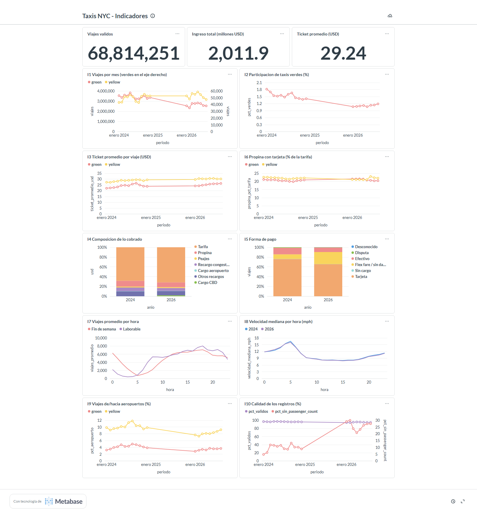
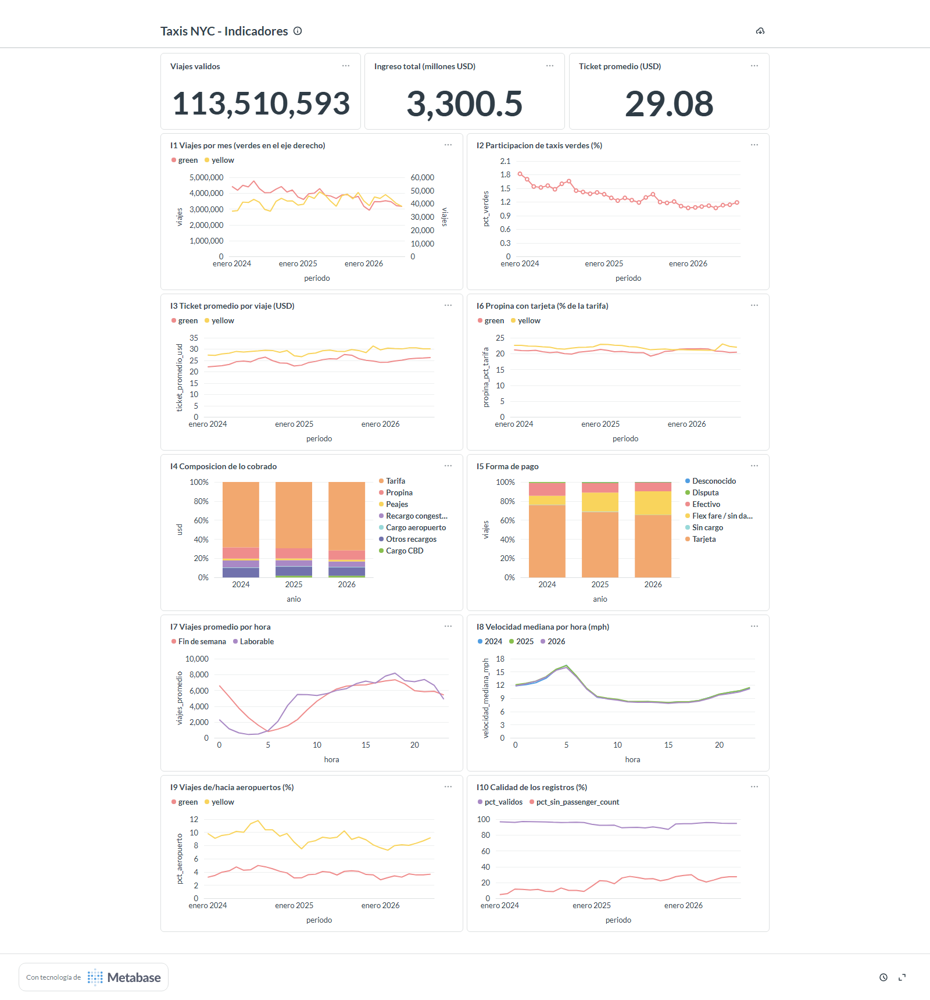

# Ejercicio 7 — Construcción de indicadores y visualización

* Consultas: [`sql/07_indicadores.sql`](../sql/07_indicadores.sql), una por indicador.
* Tablero: Metabase (la herramienta incluida en el ambiente), tablero **Taxis NYC - Indicadores**, creado con [`scripts/metabase_dashboard.py`](../scripts/metabase_dashboard.py).
* Datos: `data/processed/taxi.duckdb` (tabla `viajes` y vista `viajes_validos`, Ejercicio 6), conectada a Metabase como base DuckDB de solo lectura.

## 7.1 Preguntas de análisis

1. ¿Cuántos viajes válidos hay en el período disponible?
2. ¿Cuánto dinero se cobró en total?
3. ¿Cuánto paga en promedio un pasajero por viaje?
4. ¿Cómo evoluciona la cantidad de viajes por mes y tipo de taxi? ¿Hay estacionalidad?
5. ¿Qué participación tienen los taxis verdes y está cambiando?
6. ¿Cómo evoluciona el ticket promedio de cada tipo de taxi?
7. ¿Qué parte de lo cobrado son recargos (congestión, CBD, aeropuerto) frente a tarifa y propina?
8. ¿Cómo se reparten las formas de pago y cómo cambian entre años?
9. ¿Qué porcentaje de la tarifa dejan de propina quienes pagan con tarjeta?
10. ¿A qué horas se concentra la demanda en días laborables y en fines de semana?
11. ¿Cómo cambia la velocidad de los viajes a lo largo del día y entre años?
12. ¿Qué proporción de los viajes empieza o termina en un aeropuerto?
13. ¿Qué proporción de los registros publicados es utilizable y cuántos llegan incompletos?

## 7.2 Diseño de los indicadores

| Indicador | Pregunta | Métrica | Dimensiones | Visualización |
|---|---|---|---|---|
| K1 Viajes válidos | 1 | `count(*)` de `viajes_validos` | — | número |
| K2 Ingreso total | 2 | `sum(total_amount)` en millones de USD | — | número |
| K3 Ticket promedio | 3 | `avg(total_amount)` | — | número |
| I1 Viajes por mes | 4 | viajes | mes × tipo de taxi | líneas (verdes en eje derecho por la diferencia de escala) |
| I2 Participación de verdes | 5 | % de viajes que son verdes | mes | línea |
| I3 Ticket promedio | 6 | `avg(total_amount)` | mes × tipo | líneas |
| I4 Composición de lo cobrado | 7 | USD por componente del total | año × componente | barras apiladas al 100% |
| I5 Forma de pago | 8 | viajes por forma de pago | año × forma de pago | barras apiladas al 100% |
| I6 Propina con tarjeta | 9 | `sum(tip) / sum(fare)` en pagos con tarjeta | mes × tipo | líneas |
| I7 Viajes por hora | 10 | viajes / días calendario | hora × laborable/fin de semana | líneas |
| I8 Velocidad mediana | 11 | `median(velocidad_mph)` | hora × año | líneas |
| I9 Aeropuertos | 12 | % de viajes con origen o destino en zonas 1, 132 o 138 | mes × tipo | líneas |
| I10 Calidad de los registros | 13 | % de registros válidos y % sin `passenger_count` | mes | líneas |

Criterios de diseño:

* Todos los indicadores usan `viajes_validos` (salvo I10, que compara contra `viajes`), así que las reglas de calidad del Ejercicio 3 se aplican igual en todos.
* Ningún indicador fija años: usan `anio` y `mes` como dimensiones, así que un año nuevo aparece en el tablero sin cambiar consultas (se comprobó en el Ejercicio 8).
* Se comparan tasas y promedios, no totales, cuando la escala de los tipos de taxi es muy distinta (I2, I3, I6, I9).
* La propina se mide solo con tarjeta, porque en efectivo no se registra (Ejercicio 4, P6).
* La velocidad se resume con la mediana por las colas largas de la distribución.

## 7.3 Consultas SQL

Cada indicador es una consulta con nombre en [`sql/07_indicadores.sql`](../sql/07_indicadores.sql) (`K1_viajes` … `I10_calidad`), precedida por la pregunta que responde. El script de Metabase envía exactamente ese texto como pregunta SQL nativa y usa la línea `-- Pregunta` como descripción de la tarjeta.

## 7.4 Visualizaciones

`scripts/metabase_dashboard.py` crea cada visualización por la API de Metabase con el tipo y los ejes indicados en 7.2 (números para K1–K3, líneas para series temporales y perfiles horarios, barras apiladas al 100% para composiciones). Así el tablero se puede recrear desde cero con un comando y queda versionado en el repositorio.

## 7.5 Tablero

Organización de arriba hacia abajo: totales (K1–K3); volumen (I1, I2); precio y propina (I3, I6); composición del cobro y forma de pago (I4, I5); patrones horarios (I7, I8); aeropuertos y calidad de datos (I9, I10).

Estado al construirlo (Ejercicio 7, datos de 2024 y 2026):

Estado final, con 2024, 2025 y 2026 (Ejercicio 8):

## 7.6 Justificación de cada indicador

| Indicador | Por qué se eligió |
|---|---|
| K1–K3 | Dan la escala del sistema (cuántos viajes, cuánto dinero, cuánto por viaje) y sirven de referencia para leer el resto. |
| I1 | La demanda es la variable principal del negocio; la serie mensual muestra estacionalidad y tendencia. |
| I2 | La participación de los verdes resume en un número si las dos flotas cambian de peso, algo que I1 no muestra por la diferencia de escala. |
| I3 | El ticket promedio refleja cambios de tarifas, recargos y tipo de viaje; es lo que paga el usuario. |
| I4 | Desde 2025 existe un cargo nuevo (CBD); separar tarifa, propina y recargos muestra cuánto pesa cada uno. |
| I5 | La forma de pago condiciona qué se puede medir (la propina) y reveló el crecimiento de los registros sin dato. |
| I6 | La propina mide la satisfacción o los hábitos del pasajero; restringida a tarjeta es comparable entre períodos. |
| I7 | El perfil horario define cuándo se necesita oferta; laborable y fin de semana tienen patrones opuestos. |
| I8 | La velocidad es un indicador indirecto de congestión, relevante desde el cargo por congestión de 2025. |
| I9 | Los aeropuertos son un mercado distinto (viajes largos, tarifa fija) y su peso afecta los promedios. |
| I10 | Ningún indicador es confiable si los datos no lo son; este muestra cuánto se descarta y cuánto llega incompleto. |

## 7.7 Consultas de cada indicador

| Indicador | Consulta | Fuente | Lógica principal |
|---|---|---|---|
| K1 | `K1_viajes` | `viajes_validos` | `count(*)` |
| K2 | `K2_ingreso` | `viajes_validos` | `sum(total_amount) / 1e6` |
| K3 | `K3_ticket` | `viajes_validos` | `avg(total_amount)` |
| I1 | `I1_viajes_mensuales` | `viajes_validos` | `count(*)` por `make_date(anio, mes, 1)` y `tipo_taxi` |
| I2 | `I2_participacion_verdes` | `viajes_validos` | `count_if(tipo_taxi = 'green') / count(*)` por mes |
| I3 | `I3_ticket_promedio` | `viajes_validos` | `avg(total_amount)` por mes y tipo |
| I4 | `I4_composicion_cobro` | `viajes_validos` | sumas por componente y año, `UNPIVOT` a filas |
| I5 | `I5_forma_pago` | `viajes_validos` | `count(*)` por año y `forma_pago` |
| I6 | `I6_propina_tarjeta` | `viajes_validos` | `sum(tip_amount) / sum(fare_amount)` con `forma_pago = 'Tarjeta'` |
| I7 | `I7_demanda_hora` | `viajes_validos` | viajes / días distintos, por hora y tipo de día |
| I8 | `I8_velocidad_hora` | `viajes_validos` | `median(velocidad_mph)` por hora y año |
| I9 | `I9_aeropuertos` | `viajes_validos` | `count_if(origen o destino en 1, 132, 138) / count(*)` |
| I10 | `I10_calidad` | `viajes` y `viajes_validos` | válidos / registros y nulos de `passenger_count` / registros, por mes |

## 7.8 Interpretación y hallazgos

Valores del tablero con los tres años (enero de 2024 a agosto de 2026):

* **Escala (K1–K3):** 113.5 millones de viajes válidos, USD 3,300.5 millones cobrados y un ticket promedio de USD 29.08.
* **Demanda (I1):** fuerte estacionalidad, con caídas en enero–febrero y julio–agosto y máximos en primavera y otoño. El mes con más viajes amarillos fue mayo de 2025 (4.09 millones). Los verdes bajan de ~50–57 mil viajes mensuales en 2024 a ~35–42 mil en 2026.
* **Participación de verdes (I2):** cae de 1.54% de los viajes en 2024 a 1.24% en 2025 y 1.11% en 2026. Las dos flotas se separan: los amarillos crecen y los verdes se reducen.
* **Precio (I3, I4):** el ticket promedio sube de ~USD 27 a ~30.5 en amarillos y de ~22 a ~26 en verdes entre inicios de 2024 y 2026. La tarifa base gana peso en lo cobrado (68.5% → 71.6%), mientras que la propina (11.7% → 9.7%) y el recargo estatal de congestión (7.2% → 5.7%) pierden. El cargo CBD, que no existía en 2024, representa 1.8–1.9% desde 2025.
* **Pago (I5, I6):** la tarjeta baja de 75.9% a 65.4% y el efectivo de 13.5% a 9.2%, mientras que "Flex fare / sin dato" sube de 9.2% a 24.7%. Entre quienes pagan con tarjeta, la propina es estable (~21–22% de la tarifa). Por eso la caída de la propina en I4 se explica por los registros sin dato de pago, no porque se deje menos propina.
* **Horario (I7, I8):** los días laborables tienen su pico a las 18 h (~8,200 viajes por hora) y su mínimo a las 3 h (~440). Los fines de semana mantienen ~6,600 viajes por hora a medianoche, casi tres veces más que un día laborable. La velocidad mediana es la imagen inversa de la demanda: ~16 mph a las 5 h y ~8 mph entre las 11 y las 17 h. 2026 es más lento que 2025 en todas las horas, y más lento que 2024 entre las 9 y las 23 h.
* **Aeropuertos (I9):** entre 9% y 12% de los viajes amarillos de 2024 tocaban un aeropuerto, con picos en verano; en 2025 la proporción baja a 7.5–10% y en 2026 a 7.3–9.2%. En verdes se mantiene en 3–5%.
* **Calidad (I10):** en 2024, entre 95.8% y 97% de los registros pasa las reglas de calidad. En 2025 baja a 92–94% en el primer trimestre y a 87–90% entre mayo y noviembre (mínimo de 87.2% en noviembre), por un aumento de registros con tarifa o total no positivo; vuelve a 94% en diciembre de 2025 y a 94–96% en 2026. Los registros sin `passenger_count` pasan de 5–13% en 2024 a 15–28% en 2025 y 21–30% en 2026.

**Principales hallazgos:**

1. La demanda de taxis amarillos creció en 2025 y se mantiene en 2026, mientras que la de taxis verdes cae de forma sostenida.
2. Viajar en taxi amarillo es más caro en 2026 (ticket promedio +6.8% entre enero–agosto de 2024 y de 2026, notebook 08), principalmente por la tarifa base; el cargo CBD agrega un componente pequeño pero presente en ~73% de los viajes amarillos.
3. La calidad de los datos de pago empeora: un cuarto de los viajes recientes no informa forma de pago, lo que sesga a la baja los indicadores de propina y de pago con tarjeta si no se controla.
4. Los patrones horarios son estables entre años: el perfil de demanda y de velocidad casi no cambia, así que las diferencias entre años vienen del volumen y el precio, no del comportamiento horario.
